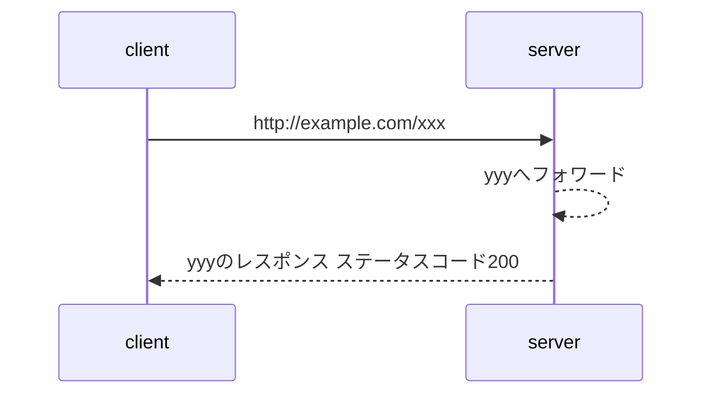
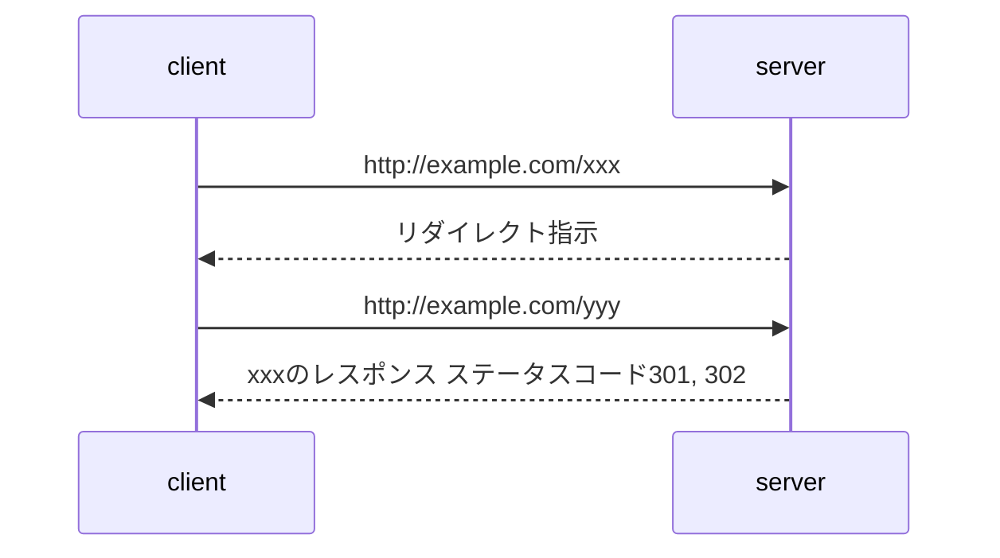

# フォワードとリダイレクト

フォワードとリダイレクトはどちらも転送方式

## フォワード

## リダイレクト

ステータスコードの意味

* 301: 永続的なリダイレクト
* 302: 一時的なリダイレクト

## リンク

[リダイレクトとフォワードの仕組みと違い | Web基礎](https://k-sasaking.net/programing/redirect-forwad/)
